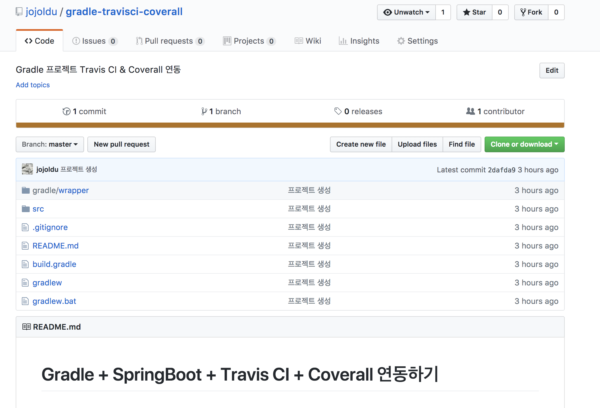
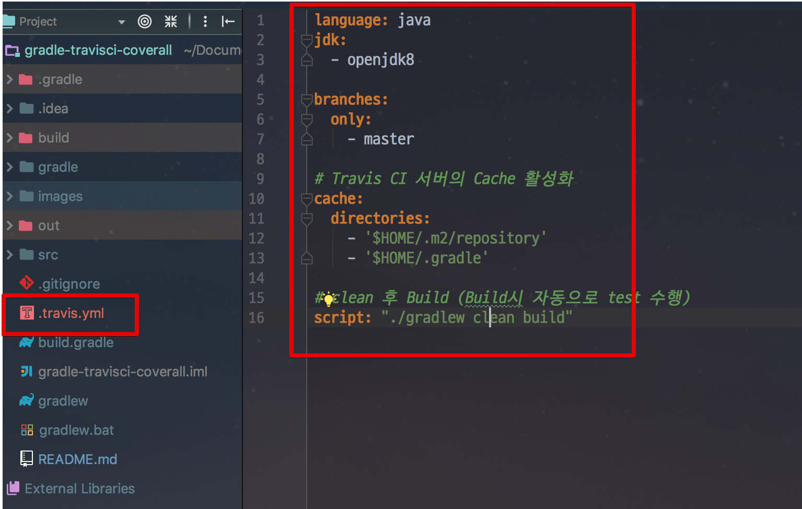

# Gradle + SpringBoot + Travis CI + Coverall 연동하기


최근에 개인프로젝트를 진행하면 무조건 진행하는 것이 바로 CI 연동입니다.  
지속적으로 통합 빌드/테스트가 된다는게 개인 프로젝트에서는 정말 큰 도움이 됩니다.  
개인프로젝트에서 CI연동을 하면 다음과 같은 작업이 자동화됩니다.  
  
하나의 기능을 수정 혹은 추가 후 Git Push  
-> Travis CI에서 통합 빌드 및 테스트  
-> Coverall에서 테스트 커버리지 측정  
-> 텔레그램으로 CI 결과 알람  
  
물론 여기서 AWS CodeDeploy나 다른 CD 툴을 사용한면 배포까지 자동화 시킬수 있습니다.  

> 관련된 내용은 [스프링부트로 웹 서비스 출시하기 - 6. TravisCI & AWS CodeDeploy로 배포 자동화 구축하기](http://jojoldu.tistory.com/265)를 참고해보세요!  

앞서 [스프링부트로 웹 서비스 출시하기 시리즈](http://jojoldu.tistory.com/250?category=635883)에서 CI/CD 환경을 소개 드렸는데요.  
여기서 **Coverall로 테스트커버리지 실시간 측정, 텔레그램 봇과의 연동** 등이 누락되기도 했었고, 시리즈 전체 없이 단순 Java/Gradle 환경에서 CI연동 방법만 보고 싶으신 분들이 계셔서 정리하게 되었습니다.

> 이번편 다음으로는 **Gradle 멀티 모듈환경에서의 Coverall 연동 방법**을 소개드릴 예정입니다.
  
자 그럼 본격적으로 시작하겠습니다!
  
## 1. 프로젝트 생성 및 Github 연동

> 모든 프로젝트 코드는 [Github](https://github.com/jojoldu/gradle-travisci-coverall)에 있습니다.  

간단한 스프링부트 프로젝트를 생성하겠습니다.  
꼭 스프링부트일 필요는 없으며, Java/Gradle 환경이면 무관합니다.  
프로젝트 생성후, 간단한 코드를 추가하겠습니다.

```java
public class Calculator {
    public static long sum(long num1, long num2){
        return num1+num2;
    }
}

```

그리고 이를 테스트하는 코드를 하나 추가하겠습니다.

```java
import org.junit.Test;

import static org.assertj.core.api.Assertions.assertThat;

public class CalculatorTest {

    @Test
    public void 숫자2개를_더한값이_반환된다(){
        //given
        long num1 = 1;
        long num2 = 2;

        //when
        long sum = Calculator.sum(num1, num2);

        //thwn
        assertThat(sum).isEqualTo(3);
    }
}

```

자 그리고 이 프로젝트를 [Github](https://github.com/jojoldu/gradle-travisci-coverall)과 연동합니다.



> Github 연동이 처음이라면 진유리님께서 만드신 [초심자를 위한 Github 협업 튜토리얼](https://milooy.wordpress.com/2017/06/21/working-together-with-github-tutorial/)를 참고해보세요!

자 그럼 이제 **테스트 코드가 포함된 Gradle 프로젝트가 Github**에 올라갔습니다!  
본격적으로 연동 작업을 시작해보겠습니다.

## 2. Travis CI 연동

[Travis CI](https://travis-ci.org/)로 접속합니다.  
로그인 하신뒤, 본인의 프로필 페이지로 이동합니다.


방금 올린 저장소를 검색해서 찾아 아래와 같이 활성화시킵니다.


그리고 프로젝트에 ```.travis.yml``` 파일을 생성해서 아래 내용을 추가합니다.

```yml
language: java
jdk:
  - openjdk8

branches:
  only:
    - master

# Travis CI 서버의 Cache 활성화
cache:
  directories:
    - '$HOME/.m2/repository'
    - '$HOME/.gradle'

# clean 후 Build (Build시 자동으로 test 수행)
script: "./gradlew clean build"
```



## 3. Coverall 연동

## 4. 텔레그램 봇 연동
  
  

